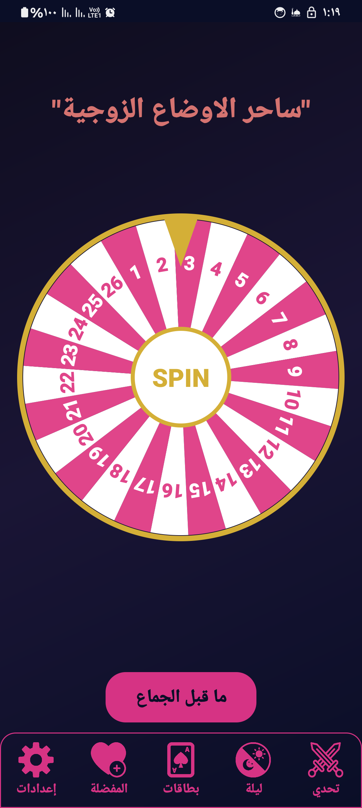
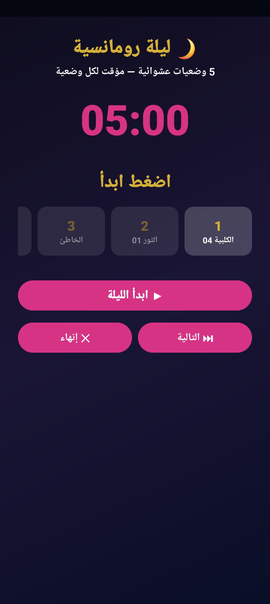

  

<h1 align="center">مدار السعادة - Intimacy</h1>

  

---

## 📌 نبذة عن التطبيق :

تطبيق تفاعلي يهدف إلى إضافة عنصر المفاجأة والتجديد للحياة الزوجية، من خلال أدوات عشوائية محترمة. يحتوي على:

- 🎡 **عجلة حظ (SPIN)** لاختيار أوضاع أو أنشطة متنوعة  
- 🎯 **وضع التحدي** الذي يسمح للزوجين باختيار وضعية معينة  
- 💖 **ليلة رومانسية** تقدم 5 خيارات عشوائية مع مؤقت زمني لكل منها  
- 🃏 **وضع البطاقات** حيث يقوم أحد الشريكين باختيار بطاقة أو كشفها  
- ⚙️ إعدادات متقدمة مثل:
  - وضع عدم التكرار لتجنب تكرار نفس الخيارات  
  - خيارات الصوت والاهتزاز الخفيف  

التطبيق مصمم خصيصًا للمتزوجين، مع التركيز على الاحترام والخصوصية.

---

## 📸 معاينة التطبيق :

  
  
  

---

## 🌐 تواصل معنا :

  
  
  
  
  
  

---

  <b> All Rights Reserved - @XERNEL0x58</b>

